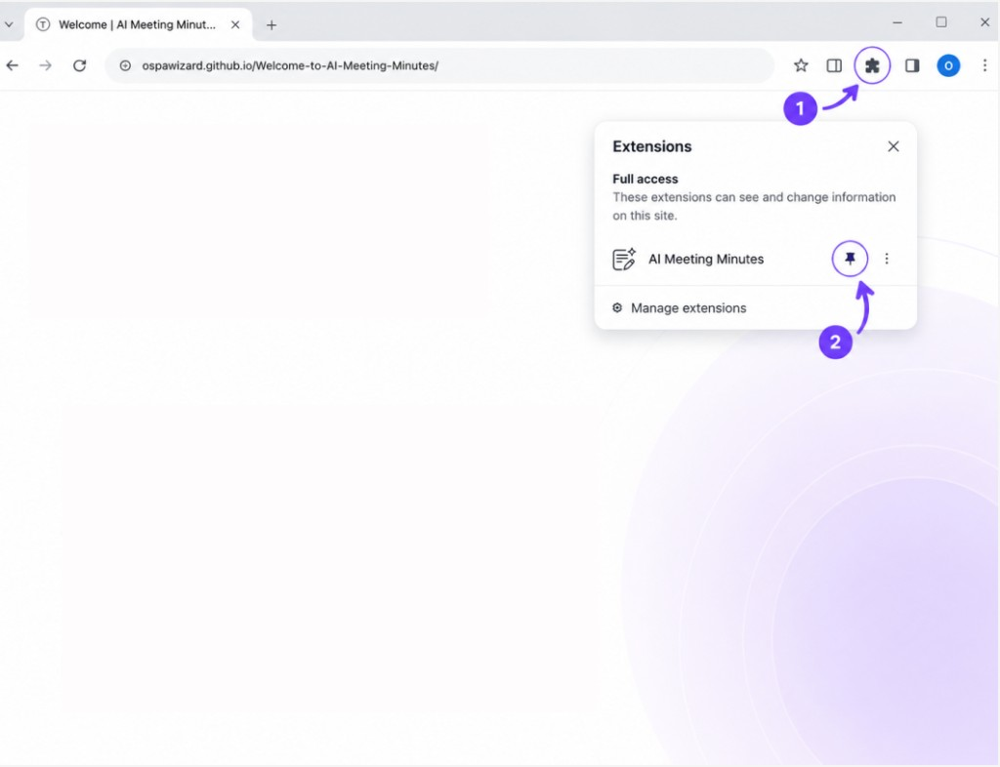
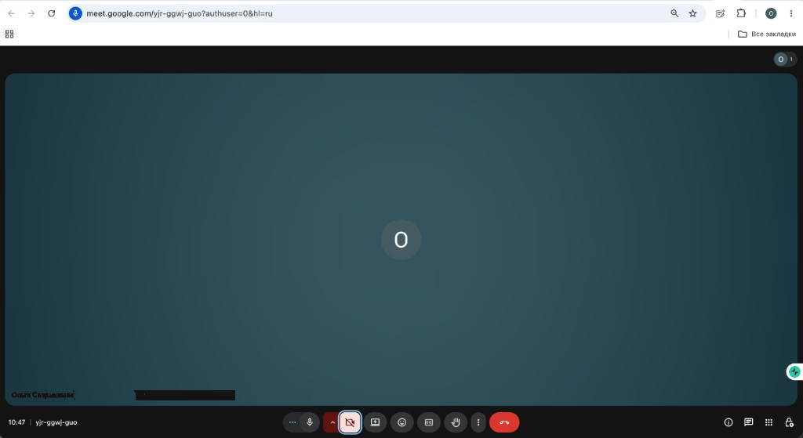

# Welcome to AI Meeting Minutes

Welcome page for the **AI Meeting Minutes** Chrome extension.  
Published at: [https://ospawizard.github.io/Welcome-to-AI-Meeting-Minutes/](https://ospawizard.github.io/Welcome-to-AI-Meeting-Minutes/)

Layout follows the same pattern as [MP4 to MP3 welcome](https://mp4-to-mp3.pro/welcome): header, two steps with large images, and “How to pin / How to open” hints.

## Project structure

```
Welcome-to-AI-Meeting-Minutes/
├── index.html
├── css/welcome.css
├── images/
│   ├── logo.svg          # Extension logo (header)
│   ├── how-to-pin.svg    # Step 1 illustration (replace with screenshot)
│   └── how-to-open.svg   # Step 2 illustration (replace with screenshot)
└── README.md
```

## Replace illustrations with real screenshots

1. Take screenshots in Chrome (pin menu + side panel open on a Meet tab).
2. Save as `images/how-to-pin.png` and `images/how-to-open.png` (recommended width ~860px).
3. In `index.html`, change the `src` on each step image:

```html


```

PNG, WebP, and SVG all work on GitHub Pages.

## GitHub Pages

1. Create a repo named `Welcome-to-AI-Meeting-Minutes` on GitHub.
2. Push this folder.
3. **Settings → Pages →** Source: **Deploy from branch** → branch `main` → folder `/ (root)`.
4. Site URL: `https://<username>.github.io/Welcome-to-AI-Meeting-Minutes/`

## Extension: open welcome on install

In `background.js` of the extension:

```javascript
chrome.runtime.onInstalled.addListener(({ reason }) => {
  if (reason === "install") {
    chrome.tabs.create({
      url: "https://ospawizard.github.io/Welcome-to-AI-Meeting-Minutes/",
    });
  }
  // … existing warmup logic
});
```

Update the **Install the extension** link in `index.html` (`#installLink`) to your Chrome Web Store listing when it is live.

## Local preview

```bash
cd Welcome-to-AI-Meeting-Minutes
python3 -m http.server 8080
# open http://localhost:8080
```
